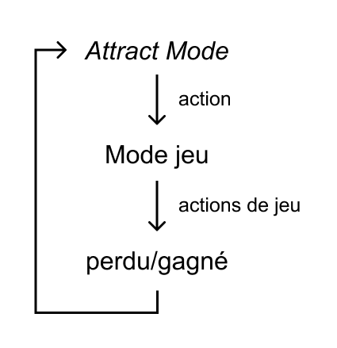
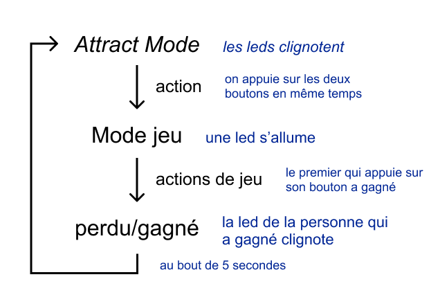
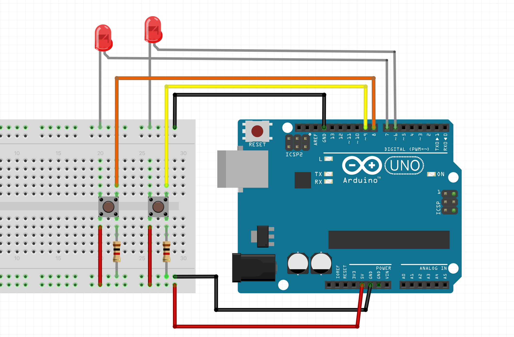

# FiniteStateMachine_Arduino

Un principe de jeu de base :



On a un *Attract Mode* qui donne envie de jouer. En faisant une action, on passe de l'*Attract Mode* au **mode de jeu**. On joue au jeu, ce qui nous amène à avoir un gagnant/un perdant, un score, ainsi de suite, qui est affiché dans un mode que j'appelle *perdu/gagné*. Au bout d'un moment ou avec une action, on passe du mode *perdu/gagné* à *l'Attract Mode* à nouveau, pour commencer une nouvelle partie.

On va faire un jeu qui reprend ce principe :



Dans l'Attract mode : les leds clignotent, et on passe au mode jeu en appuyant sur les deux boutons simultanément.

Mode jeu : une des leds s'allume, le premier qui appuie sur le bouton à l'allumage de la led a gagné.

Mode perdu/gagné : la led du coté du joueur gagnant clignote, on retourne à l'attract mode après 5 secondes de clignotements.

## Mise en place

### Le montage



Les leds sont branchés sur les pins 6 et 7, et les boutons sont sur les pins 8 et 9.

<!-- photo du montage -->

### Le début du code

D'abord je déclare les pins des leds et boutons au dessus du setup() :
```c
int pinLed1 = 6;
int pinLed2 = 7;
int pinBouton1 = 8;
int pinBouton2 = 9;
```

On va également créer une variable `gameState` qui nous permet de naviguer entre les modes. Le mode 0 est l'AttractMode, le mode 1 est le mode de jeu, et le mode 2 est le mode perdu/gagné.

On déclare donc :
```c
int gameState = 0; //le mode par défaut est l'Attract Mode
```

Et dans le setup() je déclare le mode des pins :

```c
void setup() {
  pinMode(pinLed1, OUTPUT);
  pinMode(pinLed2, OUTPUT);
  pinMode(pinBouton1, INPUT);
  pinMode(pinBouton2, INPUT);
}
```

## Attract Mode

Dans l'Attract Mode, je veux que les deux leds clignotent en décalé toutes les secondes, et qu'on quitte l'Attract Mode en appuyant sur les deux boutons en même temps.

### Créer l'animation

Pour faire clignoter une led, on pourrait écrire dans le loop() : 

```c
void loop() {

digitalWrite(pinLed1, HIGH); //la led s'allume
delay(1000); //on attend 1 seconde
digitalWrite(pinLed1, LOW); //la led s'éteinte
delay(1000); //on attend 1 seconde
}
```
Mais dans notre cas, on ne veux pas utiliser la fonction ``delay()``car elle bloque le code, et on ne recevrait donc pas l'information des boutons qui nous ferait quitter l'Attract Mode.

On va donc plutôt utiliser la fonction `millis()`, qui donne (en millisecondes) le temps depuis lequel la carte Arduino est allumée.

On va donc plutôt créer un système avec une variable `timing`. On va écrire une condition qui définit que quand `millis()` (= "l'heure" qu'il est) est plus grand que `timing` + 1 seconde, alors on change l'état de la led (on l'allume ou on l'éteint) et on redéfinit `timing`.

On définit donc la variable `timing` au dessus du setup(), avec la ligne :
```c
long timing = 0;
```
Et on crée notre condition dans le loop() :

```c
void loop() {

  if (millis() > timing + 1000) {
    // on change l'état de la led
    timing = millis();
  }
}
```

Pour changer l'état de la led, on crée un booléen `ledState1` pour savoir si la led était éteinte ou allumée précédemment, et donc si on doit l'éteindre ou l'allumer.

On définit donc la variable `ledState1` au dessus du setup(), avec la ligne :
```c
bool ledState1 = LOW;
```
Et on met à jour notre condition dans le loop() :
```c
void loop() {

  if (millis() > timing + 1000) {
    ledState1 =! ledState1; //ledState1 devient le contraire de ledState1
    digitalWrite(pinLed1, ledState1); //on donne l'état ledState1 à la led
    timing = millis();
  }
}
```

Notre led1 clignote, et pour faire en sorte que la led2 clignote en décalé, on prend le même principe mais on définit la variable `ledState2` en HIGH par défaut :
```c
bool ledState2 = HIGH;
```
 Dans le loop() :

```c
void loop() {

  if (millis() > timing + 1000) {
    ledState1 =! ledState1; //ledState1 devient le contraire de ledState1
    ledState2 =! ledState2; //ledState2 devient le contraire de ledState2
    digitalWrite(pinLed1, ledState1); //on donne l'état ledState1 à la led1
    digitalWrite(pinLed2, ledState2); //on donne l'état ledState2 à la led2
    timing = millis();
  }
}
```

### Limiter l'animation à l'Attract Mode et quitter l'Attract Mode

Pour que le clignotement des leds ne soit que dans l'Attract Mode, on va créer une condition prenant en compte l'état de la variable `gameState`.

```c
void loop() {

  if (gameState == 0) {  //si on est dans l'Attract Mode
    if (millis() > timing + 1000) {
      ledState1 = !ledState1;            //ledState1 devient le contraire de ledState1
      ledState2 = !ledState2;            //ledState2 devient le contraire de ledState2
      digitalWrite(pinLed1, ledState1);  //on donne l'état ledState1 à la led1
      digitalWrite(pinLed2, ledState2);  //on donne l'état ledState2 à la led2
      timing = millis();
    }
  }
}
```

À la fin de notre condition du `gameState`, on va créer une condition qui définit que si on appuie sur les deux boutons en même temps, alors on passe du `gameState` 0 au `gameState1`

On veux donc créer la condition suivante :

```c
    if (digitalRead(pinBouton1) == 1 && digitalRead(pinBouton2) == 1) {
      gameState = 1;
    }
```

On peux simplifier en créant des variables int `buttonState1` et `buttonState2`, et en écrivant dans le loop() :
```c
buttonState1 = digitalRead(pinBouton1);
buttonState2 = digitalRead(pinBouton2);
```

Afin de pouvoir écrire 
```c
    if (buttonState1 == 1 && buttonState2 == 1) {
      gameState = 1;
    }
```

On va également éteindre les deux leds à la fin de l'Attract Mode, en changeant les ledState :
```c
    if (buttonState1 == 1 && buttonState2 == 1) {
      ledState1 = LOW;
      ledState2 = LOW;
      digitalWrite(pinLed1, ledState1);
      digitalWrite(pinLed2, ledState2);
      gameState = 1;
    }
```


On a donc l'Attract Mode avec le clignotement des leds, qu'on quitte en appuyant sur les deux boutons en même temps.

<details>

<summary> Code complet à cette étape</summary>

```c
int pinLed1 = 6;
int pinLed2 = 7;
int pinBouton1 = 8;
int pinBouton2 = 9;

int gameState = 0;  //le mode par défaut est l'Attract Mode

int buttonState1;
int buttonState2;

long timing = 0;
bool ledState1 = LOW;
bool ledState2 = HIGH;

void setup() {
  Serial.begin(9600);
  pinMode(pinLed1, OUTPUT);
  pinMode(pinLed2, OUTPUT);
  pinMode(pinBouton1, INPUT);
  pinMode(pinBouton2, INPUT);
}

void loop() {
    buttonState1 = digitalRead(pinBouton1);
    buttonState2 = digitalRead(pinBouton2);


  if (gameState == 0) {  //si on est dans l'Attract Mode
    if (millis() > timing + 1000) {
      ledState1 = !ledState1;            //ledState1 devient le contraire de ledState1
      ledState2 = !ledState2;            //ledState2 devient le contraire de ledState2
      digitalWrite(pinLed1, ledState1);  //on donne l'état ledState1 à la led1
      digitalWrite(pinLed2, ledState2);  //on donne l'état ledState2 à la led2
      timing = millis();
    }

    if (buttonState1 == 1 && buttonState2 == 1) {
      ledState1 = LOW;
      ledState2 = LOW;
      digitalWrite(pinLed1, ledState1);
      digitalWrite(pinLed2, ledState2);
      gameState = 1;
    }
  }
}

```

</details>


## Mode de jeu

Ici, le jeu est un jeu de rapidité où chaque joueur a un bouton, et dans le mode jeu une led s'allume à un moment random, et le premier qui appuie sur son bouton a gagné.

Notre mode de jeu sera dans le loop(), dans une condition qui vérifie qu'on est bien dans `gameState` == 1.

### Allumer la led

Pour qu'une led s'allume à un moment random entre 5 et 15 secondes après qu'on soit entré dans le mode de jeu, on veux savoir à quel moment on est entré dans le mode de jeu.

On va donc créer une variable `startGame` qui va nous donner "l'heure" à laquelle on a quitté l'Attract Mode, donc le moment auquel on a appuyé sur les deux boutons à la fois et on est passé du `gameState` 0 au `gameState` 1.

On commence donc par déclarer au dessus du setup() :
```c
long startGame;
```

Ensuite, on va donc donner `startGame` l'heure qu'il était dans la condition de changement de state.

On ajoute donc `startGame = millis();` :

```c
    if (buttonState1 == 1 && buttonState2 == 1) {
        startGame = millis();
        ledState1 = LOW;
        ledState2 = LOW;
        digitalWrite(pinLed1, ledState1);
        digitalWrite(pinLed2, ledState2);
        gameState = 1;
    }
```

Pour que la led s'allume au bout d'un temps entre 5 et 15 secondes après `startGame`, on crée une variable `startLed` qui sera random entre 0 et 15000 (15 secondes en millisecondes);

On commence donc par déclarer au dessus du setup() :
```c
long startLed;
```

Pour que notre fonction `random()` fonctionne, on ajoute la fonction `randomSeed()` dans le setup() pour avoir un "vrai" hasard :
```c
  randomSeed(analogRead(0));
```

Et au même moment où on update `startGame`, on va updater `startLed`. On écrit donc :

```c
    if (buttonState1 == 1 && buttonState2 == 1) {
        startGame = millis();
        startLed = random(5000, 15000);
        gameState = 1;
    }
```

Pour allumer une des deux leds, on crée une variable `whichLed`, et on lui attribue un nombre random entre 1 et 2.
Si `whichLed` == 1, alors on allume la led 1, et si `whichLed` == 2, alors on allume la led 2.

À nouveau, on définit au dessus du setup() la variable :
```c
int whichLed;
```

Et à nouveau on update `whichLed` en même temps que le reste :
```c
    if (buttonState1 == 1 && buttonState2 == 1) {
        startGame = millis();
        startLed = random(5000, 15000); //le laps de temps random est entre 5 et 15secondes
        whichLed = random(1, 3);
        gameState = 1;
        ledState1 = LOW;
        ledState2 = LOW;
        digitalWrite(pinLed1, ledState1);
        digitalWrite(pinLed2, ledState2);
    }
```

La fonction `random()` ne prendra jamais le dernier nombre de l'intervalle, donc `random(5000, 15000)` prendra n'importe quel nombre entre 5000 et 14999, et `random(1, 3)` prendra soit 1 soit 2.

Maintenant vérifier qu'on est dans le mode jeu, on va créer une condition à la suite du mode Attract : 

```c
if (gameState == 0) {  //si on est dans l'Attract Mode
    //tous les trucs qu'on a mis dans le mode attract
    //...
} else if (gameState == 1) { //si on est dans le mode jeu
  }
```

Et on va dire qu'on allume la led définie par `whichLed`, quand "l'heure" `millis()` est plus grand que `startGame` (l'heure à laquelle on est passé dans le mode jeu) + `startLed` (le temps random d'allumage de la led).

On écrit donc 
```c
} else if (gameState == 1) { //si on est dans le mode jeu
    if (millis() > startGame + startLed) //si le laps de temps random est écoulé
      if (whichLed == 1) {
        ledState1 = HIGH;
        digitalWrite(pinLed1, ledState1);
      } else if (whichLed == 2) {
        ledState2 = HIGH;
        digitalWrite(pinLed2, ledState2);
      }
}
```

### Vérifier le gagnant et passer au mode perdu/gagné

Maintenant qu'une led s'attend à un moment random, on veux que le premier joueur à avoir appuyé sur son bouton gagne.

On vérifie donc l'état de chaque bouton, dans la boucle où les leds sont allumés, et si un des boutons est appuyé, on quitte le mode de jeu et on passe au mode perdu/gagné.

```c
  } else if (gameState == 1) {
    if (millis() > startGame + startLed) //si le laps de temps random est écoulé
      if (whichLed == 1) {
        ledState1 = HIGH;
        digitalWrite(pinLed1, ledState1);
      } else if (whichLed == 2) {
        ledState2 = HIGH;
        digitalWrite(pinLed2, ledState2);
      }

    if (buttonState1 == HIGH) { //si on appuie sur le bouton1
      gameState = 2;
    } else if (buttonState2 == HIGH) { //si on appuie sur le bouton2
      gameState = 2;
    }
  }
```

Pour déclarer le gagnant, on crée une variable `winner` qu'on définit au dessus du setup() :
```c
int winner;
```
Et dans la partie où on passe au mode perdu/gagnant, on déclare le gagnant, sachant que le premier qui appuie fait en sorte qu'on quitte le mode jeu, et donc qu'on ne teste pas le bouton de l'autre :
```c
    if (buttonState1 == HIGH) { //si on appuie sur le bouton1
      gameState = 2;
      winner = 1;
    } else if (buttonState2 == HIGH) { //si on appuie sur le bouton2
      gameState = 2;
      winner = 2;
    }
```

On éteint également les deux leds, même si une seule était allumée :
```c
      if (buttonState1 == HIGH) {  //si on appuie sur le bouton1
        gameState = 2;
        ledState1 = LOW;
        ledState2 = LOW;
        digitalWrite(pinLed1, ledState1);
        digitalWrite(pinLed2, ledState2);
        winner = 1;
      } else if (buttonState2 == HIGH) {  //si on appuie sur le bouton2
        gameState = 2;
        ledState1 = LOW;
        ledState2 = LOW;
        digitalWrite(pinLed1, ledState1);
        digitalWrite(pinLed2, ledState2);
        winner = 2;
      }
```

On a donc crée le mode de jeu où un des deux leds s'allume au hasard, dans un laps de temps random entre 5 et 15 secondes depuis le début du mode de jeu, où le gagnant est le premier à avoir appuyé sur son bouton à l'allumage de la led. Lorsqu'il y a un gagnant, on passe au mode perdu/gagné.

<details>

<summary> Code complet à cette étape</summary>

```c
int pinLed1 = 6;
int pinLed2 = 7;
int pinBouton1 = 8;
int pinBouton2 = 9;

int buttonState1;
int buttonState2;

int gameState = 0;  //le mode par défaut est l'Attract Mode

long timing = 0;
bool ledState1 = LOW;
bool ledState2 = HIGH;

long startLed;
long startGame;

int whichLed;
int winner;

void setup() {
  Serial.begin(9600);
  pinMode(pinLed1, OUTPUT);
  pinMode(pinLed2, OUTPUT);
  pinMode(pinBouton1, INPUT);
  pinMode(pinBouton2, INPUT);

  randomSeed(analogRead(0));
}

void loop() {

  buttonState1 = digitalRead(pinBouton1);
  buttonState2 = digitalRead(pinBouton2);

  if (gameState == 0) {  //si on est dans l'Attract Mode
    if (millis() > timing + 1000) {
      ledState1 = !ledState1;            //ledState1 devient le contraire de ledState1
      ledState2 = !ledState2;            //ledState2 devient le contraire de ledState2
      digitalWrite(pinLed1, ledState1);  //on donne l'état ledState1 à la led1
      digitalWrite(pinLed2, ledState2);  //on donne l'état ledState2 à la led2
      timing = millis();
    }
    if (buttonState1 == 1 && buttonState2 == 1) {
      startGame = millis();
      startLed = random(5000, 15000);  //le laps de temps random est entre 5 et 15secondes
      whichLed = random(1, 3);
      ledState1 = LOW;
      ledState2 = LOW;
      digitalWrite(pinLed1, ledState1);
      digitalWrite(pinLed2, ledState2);
      gameState = 1;
    }
  } else if (gameState == 1) {
    if (millis() > startGame + startLed) {  //si le laps de temps random est écoulé
      if (whichLed == 1) {
        ledState1 = HIGH;
        digitalWrite(pinLed1, ledState1);
      } else if (whichLed == 2) {
        ledState2 = HIGH;
        digitalWrite(pinLed2, ledState2);
      }

      if (buttonState1 == HIGH) {  //si on appuie sur le bouton1
        gameState = 2;
        ledState1 = LOW;
        ledState2 = LOW;
        digitalWrite(pinLed1, ledState1);
        digitalWrite(pinLed2, ledState2);
        winner = 1;
      } else if (buttonState2 == HIGH) {  //si on appuie sur le bouton2
        gameState = 2;
        ledState1 = LOW;
        ledState2 = LOW;
        digitalWrite(pinLed1, ledState1);
        digitalWrite(pinLed2, ledState2);
        winner = 2;
      }
    }
  }
}
```

</details>

## Perdu/gagné

Dans le mode perdu/gagné, je veux que la led du coté du gagnant clignote rapidement pendant 5 secondes. À la fin des 5 secondes, on retourne dans l'Attract Mode.

### Initialiser le timing

On récupère donc la variable `timing` du début, qu'on va updater dans la partie où on vérifie le gagnant, avec la ligne `timing = millis();` à nouveau :

```c
      if (buttonState1 == HIGH) {  //si on appuie sur le bouton1
        gameState = 2;
        ledState1 = LOW;
        ledState2 = LOW;
        digitalWrite(pinLed1, ledState1);
        digitalWrite(pinLed2, ledState2);
        winner = 1;
        timing = millis();
      } else if (buttonState2 == HIGH) {  //si on appuie sur le bouton2
        gameState = 2;
        ledState1 = LOW;
        ledState2 = LOW;
        digitalWrite(pinLed1, ledState1);
        digitalWrite(pinLed2, ledState2);
        winner = 2;
        timing = millis();
      }
```

On crée ensuite la condition du `gameState` 2, à la suite des autres conditions de mode de jeu. On a donc :
```c
if (gameState == 0) {  //si on est dans l'Attract Mode
    //tous les trucs qu'on a mis dans le mode attract
    //...
  } else if (gameState == 1) { //si on est dans le mode jeu
    //tous les trucs qu'on a mis dans le mode jeu
    //...
  } else if (gameState == 2) { //si on est dans le mode perdu/gagnant
  }
```

On va faire une condition comme dans l'Attract Mode, qui fait clignoter la led, mais cette fois ci toutes les 200 millisecondes et uniquement la led du gagnant.

On écrit donc :
```c
if (gameState == 0) {  //si on est dans l'Attract Mode
    //tous les trucs qu'on a mis dans le mode attract
    //...
  } else if (gameState == 1) { //si on est dans le mode jeu
    //tous les trucs qu'on a mis dans le mode jeu
    //...
    
  } else if (gameState == 2) { //si on est dans le mode perdu/gagnant
    if (millis() > timing + 200) {
      if (winner = 1) {
        ledState1 = !ledState1;            //ledState1 devient le contraire de ledState1
        digitalWrite(pinLed1, ledState1);  //on donne l'état ledState1 à la led1
      } else if (winner == 2) {
        ledState2 = !ledState2;  //ledState2 devient le contraire de ledState2
        digitalWrite(pinLed2, ledState2);  //on donne l'état ledState2 à la led2
      }
      timing = millis();
    }
}
```

### Créer le compteur

Vu que je veux que la led clignote pendant 5 secondes, toutes les 200 millisecondes, je veux qu'elle clignote 25 fois (200*5 = 1 seconde). Je crée donc un compteur qui va compter chaque clignotement.

On déclare donc la variable `int count;` au dessus du setup(), et on ajoute un compteur dans la boucle de clignotement :

```c
    if (millis() > timing + 200) {
      if (winner = 1) {
        ledState1 = !ledState1;            //ledState1 devient le contraire de ledState1
        digitalWrite(pinLed1, ledState1);  //on donne l'état ledState1 à la led1
      } else if (winner == 2) {
        ledState2 = !ledState2;  //ledState2 devient le contraire de ledState2
        digitalWrite(pinLed2, ledState2);  //on donne l'état ledState2 à la led2
      }
      count = count +1;
      timing = millis();
    }
```

Quand `count` == 25, alors ça fait 5 secondes qu'on est dans le mode perdu/gagné et on retourne donc à l'Attract Mode.

On ajoute donc la condition :

```c
if (count == 25) {
    gameState = 0;
}
```
On pourrait avoir fini : on a un Attract Mode, on a le mode de jeu, la détection du gagnant et le mode qui affiche le gagnant avant de retourner à l'Attract Mode.

### Reset les variables

Il faut néanmoins éteindre les leds, réinitiliser le compte du clignotement et réinitialiser la variable de gagnant, pour la partie suivante : 

```c
if (count == 25) {
    gameState = 0;
    count = 0;
    winner = 0;
    ledState1 = LOW;
    ledState2 = HIGH; //pour que les leds alternent dans l'attract mode
}
```

<details>

<summary> Code final</summary>

```c
int pinLed1 = 6;
int pinLed2 = 7;
int pinBouton1 = 8;
int pinBouton2 = 9;

int buttonState1;
int buttonState2;

int gameState = 0;  //le mode par défaut est l'Attract Mode

long timing = 0;
bool ledState1 = LOW;
bool ledState2 = HIGH;

long startLed;
long startGame;

int whichLed;
int winner;

int count;

void setup() {
  Serial.begin(9600);
  pinMode(pinLed1, OUTPUT);
  pinMode(pinLed2, OUTPUT);
  pinMode(pinBouton1, INPUT);
  pinMode(pinBouton2, INPUT);

  randomSeed(analogRead(0));
}

void loop() {

  buttonState1 = digitalRead(pinBouton1);
  buttonState2 = digitalRead(pinBouton2);

  if (gameState == 0) {  //si on est dans l'Attract Mode
    if (millis() > timing + 1000) {
      ledState1 = !ledState1;            //ledState1 devient le contraire de ledState1
      ledState2 = !ledState2;            //ledState2 devient le contraire de ledState2
      digitalWrite(pinLed1, ledState1);  //on donne l'état ledState1 à la led1
      digitalWrite(pinLed2, ledState2);  //on donne l'état ledState2 à la led2
      timing = millis();
    }
    if (buttonState1 == 1 && buttonState2 == 1) {
      startGame = millis();
      startLed = random(5000, 15000);  //le laps de temps random est entre 5 et 15secondes
      whichLed = random(1, 3);
      ledState1 = LOW;
      ledState2 = LOW;
      digitalWrite(pinLed1, ledState1);
      digitalWrite(pinLed2, ledState2);
      gameState = 1;
    }
  } else if (gameState == 1) {
    if (millis() > startGame + startLed) {  //si le laps de temps random est écoulé
      if (whichLed == 1) {
        ledState1 = HIGH;
        digitalWrite(pinLed1, ledState1);
      } else if (whichLed == 2) {
        ledState2 = HIGH;
        digitalWrite(pinLed2, ledState2);
      }

      if (buttonState1 == HIGH) {  //si on appuie sur le bouton1
        gameState = 2;
        ledState1 = LOW;
        ledState2 = LOW;
        digitalWrite(pinLed1, ledState1);
        digitalWrite(pinLed2, ledState2);
        winner = 1;
        timing = millis();
      } else if (buttonState2 == HIGH) {  //si on appuie sur le bouton2
        gameState = 2;
        ledState1 = LOW;
        ledState2 = LOW;
        digitalWrite(pinLed1, ledState1);
        digitalWrite(pinLed2, ledState2);
        winner = 2;
        timing = millis();
      }
    }
  } else if (gameState == 2) {
    if (millis() > timing + 200) {
      if (winner = 1) {
        ledState1 = !ledState1;            //ledState1 devient le contraire de ledState1
        digitalWrite(pinLed1, ledState1);  //on donne l'état ledState1 à la led1
      } else if (winner == 2) {
        ledState2 = !ledState2;            //ledState2 devient le contraire de ledState2
        digitalWrite(pinLed2, ledState2);  //on donne l'état ledState2 à la led2
      }
      count = count + 1;
      timing = millis();
      if (count == 25) {
        gameState = 0;
        count = 0;
        winner = 0;
        ledState1 = LOW;
        ledState2 = HIGH;  //pour que les leds alternent dans l'attract mode
      }
    }
  }
}

```

</details>

## Simplifier le code

Le principe du jeu est fini et le jeu est entièrement fonctionnel, mais on peux simplifier le code en créant des fonctions dédiées à chacun des modes du jeu.

On crée donc `attractMode()`, `jeuMode()` et `gagnantMode()` après le `loop()`, en écrivant tout simplement :
```c
void nomDeLaFonction() {
    // code intérieure de la fonction
}
```

Dans chaque fonction, on met ce qu'il y dans les conditions correspondantes dans le loop(). À la place, on appelle chaque fonction dans sa condition correspondante.

Ça ressemble donc à ça :

```c
  if (gameState == 0) {  //si on est dans l'Attract Mode
    attractMode();
  } else if (gameState == 1) {  //si on est dans le mode jeu
    jeuMode();
  } else if (gameState == 2) {  //si on est dans le mode perdu/gagné
    gagnantMode();
  }
```

On a donc un loop() plus court, plus simple à relire notamment si on a beaucoup de modes de jeu (plusieurs niveaux, etc).

<details>

<summary> Code final **avec fonctions** </summary>

```c
int pinLed1 = 6;
int pinLed2 = 7;
int pinBouton1 = 8;
int pinBouton2 = 9;

int buttonState1;
int buttonState2;

int gameState = 0;  //le mode par défaut est l'Attract Mode

long timing = 0;
bool ledState1 = LOW;
bool ledState2 = HIGH;

long startLed;
long startGame;

int whichLed;
int winner;

int count;

void setup() {
  Serial.begin(9600);
  pinMode(pinLed1, OUTPUT);
  pinMode(pinLed2, OUTPUT);
  pinMode(pinBouton1, INPUT);
  pinMode(pinBouton2, INPUT);

  randomSeed(analogRead(0));
}

void loop() {

  buttonState1 = digitalRead(pinBouton1);
  buttonState2 = digitalRead(pinBouton2);
  if (gameState == 0) {  //si on est dans l'Attract Mode
    attractMode();
  } else if (gameState == 1) {  //si on est dans le mode jeu
    jeuMode();
  } else if (gameState == 2) {  //si on est dans le mode perdu/gagné
    gagnantMode();
  }
}

void attractMode() {
  if (millis() > timing + 1000) {
    ledState1 = !ledState1;            //ledState1 devient le contraire de ledState1
    ledState2 = !ledState2;            //ledState2 devient le contraire de ledState2
    digitalWrite(pinLed1, ledState1);  //on donne l'état ledState1 à la led1
    digitalWrite(pinLed2, ledState2);  //on donne l'état ledState2 à la led2
    timing = millis();
  }
  if (buttonState1 == 1 && buttonState2 == 1) {
    startGame = millis();
    startLed = random(5000, 15000);  //le laps de temps random est entre 5 et 15secondes
    whichLed = random(1, 3);
    ledState1 = LOW;
    ledState2 = LOW;
    digitalWrite(pinLed1, ledState1);
    digitalWrite(pinLed2, ledState2);
    gameState = 1;
  }
}

void jeuMode() {
  if (millis() > startGame + startLed) {  //si le laps de temps random est écoulé
    if (whichLed == 1) {
      ledState1 = HIGH;
      digitalWrite(pinLed1, ledState1);
    } else if (whichLed == 2) {
      ledState2 = HIGH;
      digitalWrite(pinLed2, ledState2);
    }

    if (buttonState1 == HIGH) {  //si on appuie sur le bouton1
      gameState = 2;
      ledState1 = LOW;
      ledState2 = LOW;
      digitalWrite(pinLed1, ledState1);
      digitalWrite(pinLed2, ledState2);
      winner = 1;
      timing = millis();
    } else if (buttonState2 == HIGH) {  //si on appuie sur le bouton2
      gameState = 2;
      ledState1 = LOW;
      ledState2 = LOW;
      digitalWrite(pinLed1, ledState1);
      digitalWrite(pinLed2, ledState2);
      winner = 2;
      timing = millis();
    }
  }
}

void gagnantMode() {
  if (millis() > timing + 200) {
    if (winner = 1) {
      ledState1 = !ledState1;            //ledState1 devient le contraire de ledState1
      digitalWrite(pinLed1, ledState1);  //on donne l'état ledState1 à la led1
    } else if (winner == 2) {
      ledState2 = !ledState2;            //ledState2 devient le contraire de ledState2
      digitalWrite(pinLed2, ledState2);  //on donne l'état ledState2 à la led2
    }
    count = count + 1;
    timing = millis();
    if (count == 25) {
      gameState = 0;
      count = 0;
      winner = 0;
      ledState1 = LOW;
      ledState2 = HIGH;  //pour que les leds alternent dans l'attract mode
    }
  }
}
```

</details>
